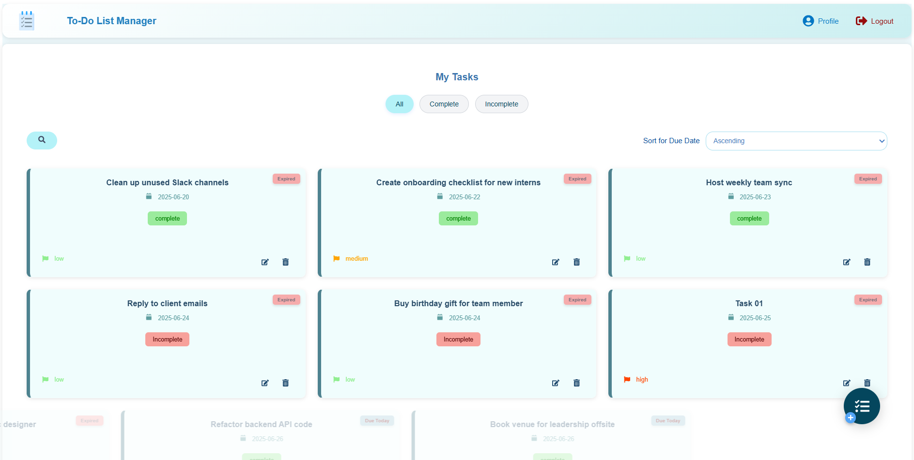
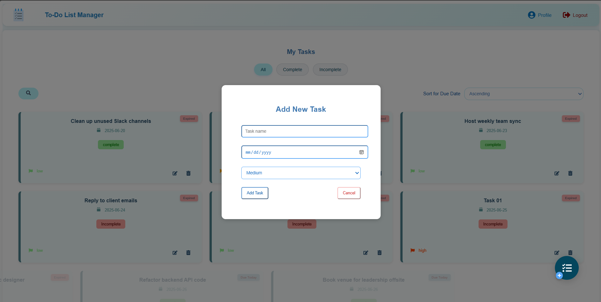
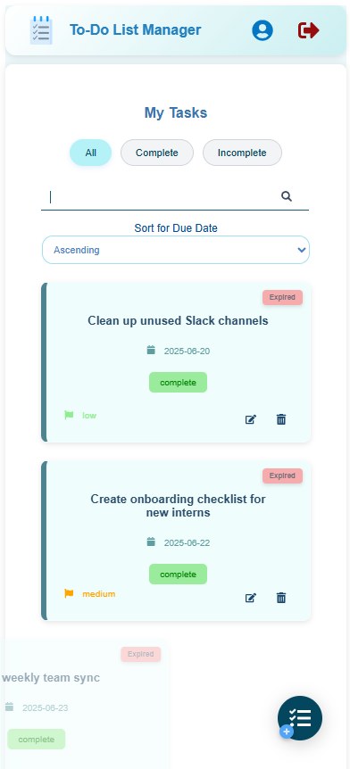
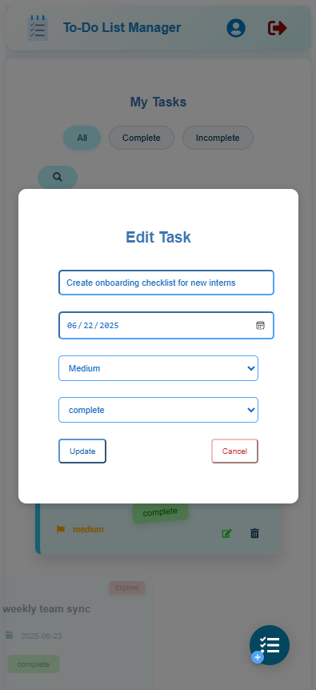
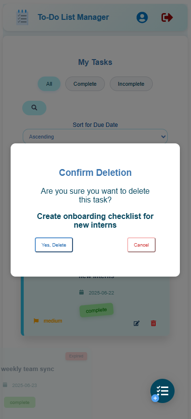

# To-Do List Manager

A minimal and modern To-Do List Manager built with React.  
Easily add, edit, delete, and sort tasks with a clean and responsive UI.

## Features

- Add new tasks
- Edit existing tasks
- Delete tasks
- Sort tasks
- Minimal and visually appealing design

## Getting Started

Follow these steps to run the app locally on your machine:

1. git clone https://github.com/ThisaraShehanKavinda/to_do_list_manager.git
cd to_do_list_manager
cd to_do_list

2. Install Dependencies
Using npm:
npm install

Or using yarn:
yarn install

3. Start the Development Server
npm start

Or with yarn:
yarn start

## Requirements
Node.js (v14 or higher)

npm (v6+) or yarn

## 📸 Screenshots

### Web View

### Mobile View

